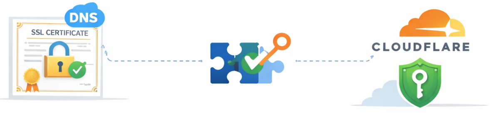

# :closed_lock_with_key: lego-cloudflare-certgen

> One-shot Docker container for automated SSL/TLS certificate generation
> via **Let's Encrypt** using [lego](https://github.com/go-acme/lego) v4.34.0
> and **Cloudflare DNS-01 challenge**. No HTTP ports or web server required.

---



---

## :sparkles: Why use this instead of running lego directly?

Running lego directly works perfectly well. This image exists for two quality-of-life improvements:

1. **Store your configuration in a `.env` file.** Instead of typing long `--email`, `--domains`, and `--dns` flags on every run, keep your settings in a file and reuse them.

2. **Use Docker Compose for a repeatable, secrets-safe workflow.** Docker Compose passes the Cloudflare API token as a [Docker secret](https://docs.docker.com/compose/use-secrets/) - mounted as a read-only file inside the container - rather than as an environment variable. This means the token never appears in `docker inspect`, process listings, or container logs.

---

## :whale: Requirements

- Docker Engine
- A Cloudflare **DNS API token** with `Zone > DNS > Edit` permission

---

### Image is not yet in [DockerHub](https://hub.docker.com/), so you'll need to build it yourself first 

#### How to build?

```bash
cd build
# Build the image
docker build -t lego-cloudflare-certgen:lego4.34.0-v0.1 .
```

---

## :rocket: Quick start

### Option A - `docker run` (simple, token in shell environment)

```bash
# 1. Copy and edit the env file (do NOT put the token here - pass it via --env)
cp template.env certgen.env

# 2. Fill all the required fields

# 3. Create directory for certificates
mkdir $(pwd)/ssl-certs

# 4. Run - token is read from your shell environment, never stored in the file
docker run --rm \
  --env-file ./certgen.env \
  --env CLOUDFLARE_API_KEY="${CLOUDFLARE_API_KEY}" \
  --volume "$(pwd)/ssl-certs:/ssl-certs" \
  --security-opt no-new-privileges:true \
  --cap-drop ALL \
  --cap-add CHOWN \
  --cap-add SETUID \
  --cap-add SETGID \
  lego-cloudflare-certgen:lego4.34.0-v0.1
```

> :warning: **`--rm` is important.** Without it, the stopped container persists on disk and its environment variables (including `CLOUDFLARE_API_KEY`) remain readable via `docker inspect`. Always use `--rm` with `docker run`.

---

### Option B - Docker Compose (recommended; token passed as secret)

```bash
# 1. Create a .env file for the Compose secret
#    Docker Compose loads .env automatically from the project directory.
echo "CLOUDFLARE_API_TOKEN=${CLOUDFLARE_API_TOKEN}" > .env

# 2. Copy and edit the container env file (no token needed here)
cp template.env certgen.env
# Edit certgen.env with your TZ, EMAIL, DOMAINS, etc.

# 3. Create directory for certificates
mkdir ./ssl-certs

# 3. Run (auto-removes the container on exit)
docker compose run --rm certgen

# 4. ⚠️ Delete .env after use (at least the Cloudflare token just to be sure).
shred -u .env   # or: rm -P .env  (macOS)
```

Certificates appear in `./ssl-certs/<timestamp>/`. For example:

```
ssl-certs/
└── 2026-04-20_17.18.00_GMT-3/
    ├── accounts/
    │   └── acme-v02.api.letsencrypt.org/
    │       └── you@example.com/
    └── certificates/
        ├── example.com.crt
        ├── example.com.issuer.crt
        ├── example.com.json
        └── example.com.key
```

---

## :gear: Configuration reference

All variables are optional unless marked **required**.

| Variable | Default | Required | Description |
|---|---|---|---|
| `TZ` | `Etc/UTC` | :x: |  [IANA timezone](https://en.wikipedia.org/wiki/List_of_tz_database_time_zones) for log timestamps and output directory names |
| `EMAIL` | - | :heavy_check_mark: | Let's Encrypt account e-mail for expiry notifications |
| `PRODUCTION` | `false` | :warning: | Set `true` to issue real, trusted certificates (rate-limited) |
| `DOMAINS` | - | :heavy_check_mark: | Comma-separated domain list. Wildcards (`*.example.com`) supported |
| `CLOUDFLARE_API_KEY` | - | :heavy_check_mark: | Cloudflare DNS API token (env var or Docker secret) |
| `PROPAGATION_SECONDS` | `60` | :x: | Seconds to wait for DNS TXT record propagation |
| `DNS_RESOLVERS` | `1.1.1.1:53,8.8.8.8:53,1.0.0.1:53` | :x: | Resolvers used to verify TXT record visibility |
| `ACCEPT_LEGO_TOS` | `false` | :warning: | Needs to be `true`. Accept [Let's Encrypt Terms of Service](https://letsencrypt.org/repository/) |
| `UID` | `1000` | :x: | Certificate file owner (UID on the host volume) |
| `GID` | `1000` | :x: | Certificate file group (GID on the host volume) |

### Wildcard domains and shell quoting

When passing `DOMAINS` via `--env` on the command line, always quote the value to prevent the shell from glob-expanding `*`:

```bash
--env 'DOMAINS=*.example.com,example.com'   # safe - single quotes
--env DOMAINS="*.example.com,example.com"   # safe - double quotes (if no files match)
--env DOMAINS=*.example.com,example.com     # just don't
```

When using `--env-file` or `certgen.env`, no quoting is necessary; Docker reads the file literally.

---

## :key: Cloudflare API token

Create a token at [dash.cloudflare.com/profile/api-tokens](https://dash.cloudflare.com/profile/api-tokens) with the following permissions:

| Resource | Permission |
|---|---|
| Zone - DNS | Edit |
| Zone - Zone | Read (if using zone-scoped tokens) |

Scope the token to only the zones (domains) you intend to certificate.

---

## :shield: Security

The container runs with the absolute minimum Linux capabilities required to do its job:

| Capability | Why it is needed |
|---|---|
| `CHOWN` | Entrypoint (root phase) sets ownership of the output directory to the target UID/GID |
| `SETUID` | `gosu` calls `setuid()` to drop from root to `certgen` |
| `SETGID` | `gosu` calls `setgid()` to drop from root to `certgen` |

All other capabilities are dropped via `--cap-drop ALL`. `--security-opt no-new-privileges:true` prevents the child process from ever gaining elevated privileges through SUID bits or file capabilities.

### Docker Compose secrets vs environment variables

| Method | Token visible in `docker inspect`? | Token visible in `env` inside container? |
|---|---|---|
| `--env CLOUDFLARE_API_KEY=...` | :white_check_mark: Yes | :white_check_mark: Yes |
| Docker secret (`/run/secrets/`) | :x: No | :x: No |

Use Docker Compose with secrets whenever possible.

### Recommended `.gitignore`

```gitignore
.env
certgen.env
ssl-certs/
```

---

## :file_folder: File structure

```
.
├── build
│   ├── Dockerfile          # Image definition
│   ├── entrypoint.sh       # Root phase: validation, user setup, privilege drop
│   ├── run_lego.sh         # Non-root phase: executes lego
│   └── validate_env.sh     # Sourced module: validates all environment variables
├── compose.yml             # Compose workflow with Docker secrets
├── example.env             # Annotated sample configuration
├── LICENSE
├── README.md
└── template.env            # Blank configuration template

```

Runtime files you create:

```
.
├── .env                    # CLOUDFLARE_API_TOKEN for Compose secret (delete after use)
└── certgen.env             # Container config (copy of template.env, filled in)
```

---

## :information_source: Notes

- **Staging by default.** `PRODUCTION=false` uses Let's Encrypt's staging environment. Staging certificates are not trusted by browsers but have much more relaxed rate limits. Always test with staging first.

- **One certificate per run.** Each `docker run` / `docker compose run` generates one certificate (which may cover multiple domains). Re-run to renew.

- **Rate limits.** Let's Encrypt allows 5 duplicate certificates per registered domain per week in production. Staging has no meaningful rate limit for testing.

---

## :page_facing_up: Licence

This project is a thin wrapper around [lego](https://github.com/go-acme/lego), which is licenced under the [MIT Licence](https://github.com/go-acme/lego/blob/master/LICENSE). Refer to the lego repository for its terms.
